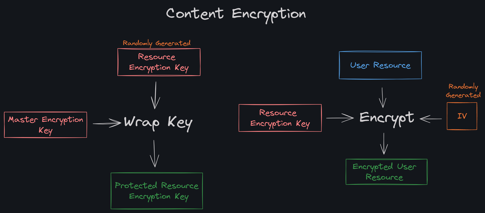

# Localful Specification - `v1`
This document contains the `v1` specification which described how the Localful project achieves client-side encryption.  
This document includes some references to the client-server architecture, security and data structure used in Localful too, but the primary focus is on the client-side encryption methodology.  
Topics such as local-first design, cross-device synchronisation and server authentication are covered in their own documentation.

---

⚠️ **Warning** ⚠️  
I'm not a mathematician, cryptographer or security expert. If you think there is a problem with this specification or my implementation, please let me know.  
I trust this specification and my implementation enough to use Localful in production myself, but at the end of the
day this is a side project I've made to solve my own needs and to learn.  
This spec and my implementation have not been officially audited or anything like that... it's a personal project.

---

## Threat Model & Requirements
TODO

## Introduction
TODO - Add context about the Localful data structure and functionality that informs this specification.

## Summary
- To use Localful (even just locally with no server) a user must supply a `user email` and `user password`.  
- The `user email` and `user password` are used to derive an `account key` which is then split into a `master unlock key` and `server password`.  
- The `server password` can be used in server authenticate if required, and is never stored on the device.
- The `master unlock key` is used to encrypt a randomly generate `master encryption key` which produces a `protected master encryption key`. This protected/encrypted value can be uploaded to the server if required.
- When a resource (user content) needs to be encrypted, a `resource encryption key` is randomly generated and is encrypted with the `master encryption key` to produces a `protected resource encryption key`. This protected/encrypted value can be uploaded along with the resource if required.
- The `account key` and `master unlock key` are never persisted anywhere, and the `master encryption key` and `resource encryption keys` are only ever kept decrypted in memory.
- As keys are never stored unencrypted on the device, so by default a user must supply `user password` every time they want to access their content again (for example on a new browser session, window, tab etc).
- An optional `user passcode` can be set up on each device instead of using `user password` every time. This passcode can be used to derive a `local unlock key` to encrypt/decrypt the `master encryption key` on the device.

### Key Derivation Diagram

### Encryption Diagram

## Specification

### KDF & Encryption Details
- `Argon2id` is used to derive a 512 bit `account key` from the `user password`, using the `user email` as salt.
  - `Argon2id` is configured with `64 MiB` of memory, 5 iterations and 1 parallelism.
- The `account key` is split in the middle for a 256 bit `master unlock key` and 256 bit `server password`.
- The randomly generated `master encryption key` and `resource encryption keys` are both 256 bit.
- `AES-GCM-256` is used for encrypting keys and resources, with randomly generated IV values.

### Encrypted Data Format

### Keys
Encrypted keys are stored as a string in the format `<metadata>:<ciphertext>`:
- `<metadata>` is currently just the Localful encryption spec version used (`v1`).
- `<ciphertext>` is a base64 encoded version of the output hash

### Data
Encrypted data is stored as a string in the format `<metadata>:<initialization-vector>:<ciphertext>`:
- `<metadata>` is currently just the Localful encryption spec version used (`v1`).
- `<initialization-vector>` is a base64 encoded version of the IV value used
- `<ciphertext>` is a base64 encoded version of the encrypted data

### Web Security
- HTTPS - The website is served over HTTPS (required by the Web Crypto API anyway).
- Content Security Policy (CSP) Headers - These are used to prevent untrusted scripts and resources loading and/or executing on the page.
- Subresource Integrity (SRI)? - TODO
- Not using any CDN, analytics or monitoring service - There are no external dependencies or services used on the site, meaning no third party code is loaded via CDNs.
- Local-first PWA - Once a user visits the site once, a service worker caches assets to allow for offline use. This means the app is not loaded from the server every time. 
- Never persisting unencrypted data - Encryption keys and content are stored encrypted in localStorage and/or IndexDB, so the user `passcode` or user `password` is required to load content into memory when the app loads.
- A password strength tool ([zxcvbn](https://www.npmjs.com/package/zxcvbn)) is used to encourage strong passwords when setting up the app.

### Server Security
- bcrypt is used for password hashing on the server
- Account verification via user `email` is required before users can save and sync data. 
- **Future** 2FA support, goal is for TOTP and WebAuthn
- **Future** rate limiting protection

## Implementation
- The standard [Web Crypto API](https://developer.mozilla.org/en-US/docs/Web/API/Web_Crypto_API) is used for all cryptographic functions except for Argon2id, which is implemented using [argon2-browser](https://www.npmjs.com/package/argon2-browser).
- Client encryption methods are implemented here...
- The server is implemented here...
- A real world application using this system is [Athena](https://github.com/ben-ryder/athena).

## Possible Improvements
- How would the specification in use and encryption method be updated once deployed in a real application?
- Consider using `XChaCha20+Poly1305` for encryption? (Using [libsodium-wrappers](https://www.npmjs.com/package/libsodium-wrappers)?)
- Server uses traditional password system. Could use Secure Remote Password (SRP) protocol instead?

## Credits
The method of splitting the derived `user key` into `master encryption key` and `server password` was inspired by the [Standard Notes 004](https://github.com/standardnotes/snjs/blob/main/packages/snjs/specification.md) specification.
